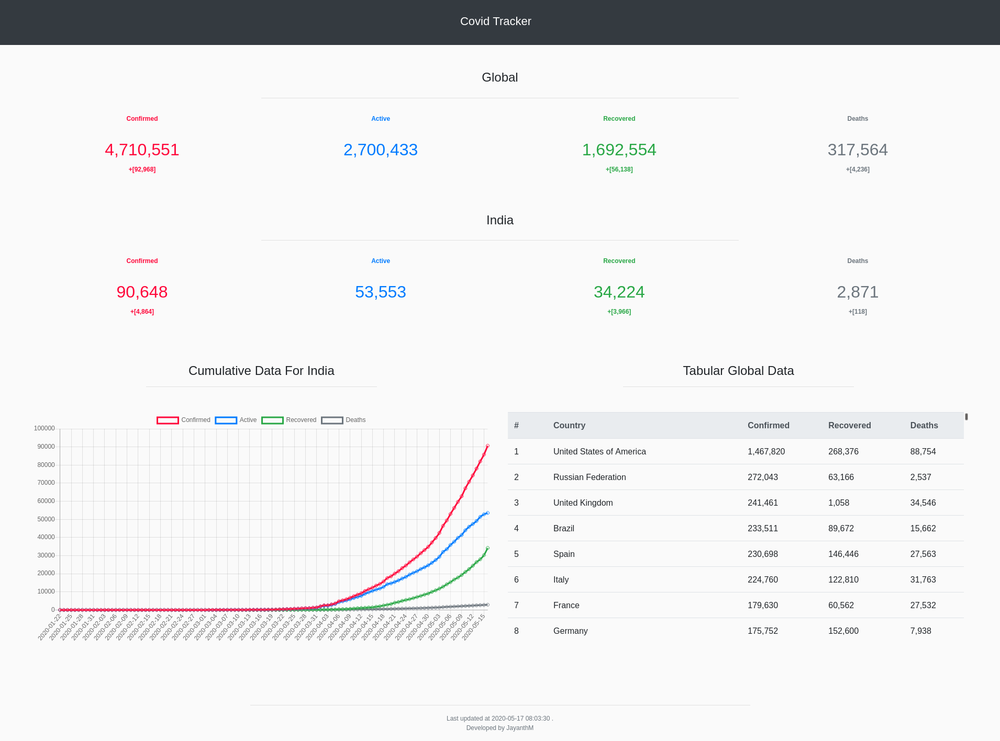

# Simple Covid Tracker - ReactJS

Wraps the data from covid19api.com, Used a simple php cron job to retrieve data and store it on my server.

Setup:

Clone the repo and type the following command to install dependencies:

`yarn install`

You'll also have to change the API endpoints in 'api/index.js' file.

Screenshots:

